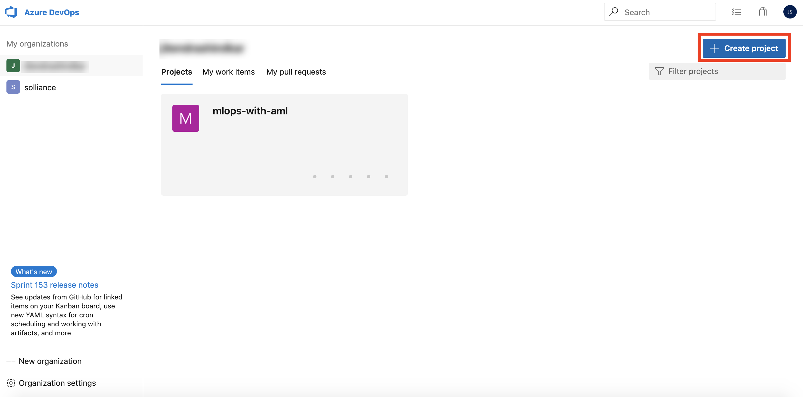
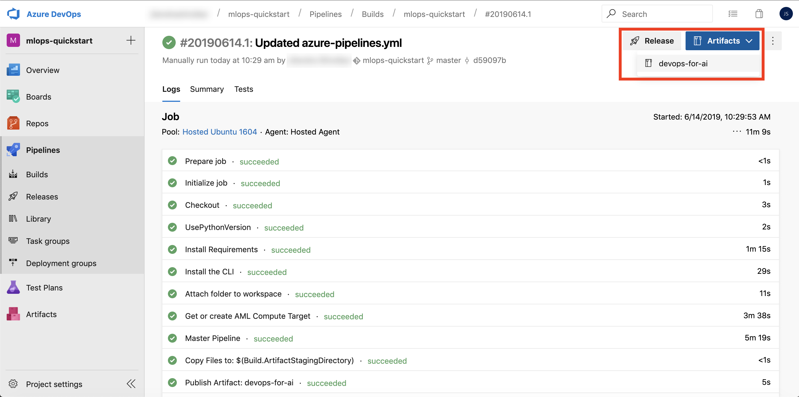

# Exercise 1: Setup New Project in Azure DevOps

## Task 1: Create New Project

1. Sign in to Azure DevOps
2. Select **Create project**

    

3. Provide Project Name: `mlops-quickstart` and select **Create**

    

## Task 2: Import Quickstart code from a Github Repo

1. Within the new project:

   a. Select **Repos** from left navigation bar
   
   b. Select **Import** from the content section
   
      
   
2. Provide the following Github URL: `https://github.com/solliancenet/mlops-starter.git` and select **Import**. This should import the code required for the quickstart.

    

## Task 3: Update the build YAML file

1. Select and open the `azure-pipelines.yml` file
2. Select **Edit** and update the following variables: `resourcegroup`, `workspace` and `location`. If you are using your own Azure subscription, please provide names to use. If an environment is provided to you be sure to replace XXXXX in the values below with your unique identifier and update the `location` variable.

    

3. Select **Commit** to save your changes.

    
  
## Task 4: Create new Service Connection

1. From the left navigation select **Project settings** and then select **Service connections**

    

2. Select **New service connection** and then select **Azure Resource Manager**

    

3. Provide the following information in the `Add an Azure Resource Manager service connection` dialog box and then select **Ok**:
 
   a. Connection name: `quick-starts-sc`
   
   b. Subscription: Select the Azure subscription to use
   
   c. Resource Group: This value should match the value you provided in the `azure-pipelines.yml` file
   
    

# Exercise 2: Setup and Run the Build Pipeline

## Task 1: Setup Build Pipeline

1. From left navigation select **Pipelines, Builds** and then select **New pipeline**

    
    
2. Select **Azure Repos Git** as your code repository

    

3. Select **mlops-quickstart** as your repository

    

4. Reivew the YAML file

    

## Task 2: Run the Build Pipeline

1. Select **Run** to start running your build pipeline

    

2. Monitor the build run. The build pipeline will take around *10-12 minutes* to run.

    

## Task 3: Review Build Artifacts

1. The build will publish an artifact named `devops-for-ai`. Select **Artifacts, devops-for-ai** to review the artifact contents.

    

2. Select **outputs, eval_info.json** and then select **Download**. The `eval_info.json` is the output from the *model evaluation* step and the information from the evaluation step will be later used in the release pipeline to deploy the model. Select **Close** to close the dialog.

    

3. Open the `eval_info.json` in a json viewer or a text editor and observe the information. The json output contains information such as if the model passed the evaluation step (`deploy_model`: *true or false*), and the name of the created image (`image_name`) to deploy.

    

## Task 4: Review Build Outputs

1. Log in to [Azure Portal](https://portal.azure.com). Open your **Resource Group, Workspace, Models** section, and observe the registered model: `cost-estimator`.

    

2. Open your **Resource Group, Workspace, Images** section and observe the deployment image created during the build pipeline: `cost-estimator-image`.

    
    
    
# Exercise 3: Setup the Release Pipeline

## Task 1: Create an Empty Job

1. Navigate to **Pipelines, Releases** and select **New pipeline**

    

2. Select **Empty job**

    

3. Provide Stage name: `Develop & Test` and close the dialog.

    

## Task 2: Add Build Artifact

1. Select **Add an artifact**

    

2. Select Source type: `Build`, Source (build pipeline): `mlops-quickstart`. *Observe the note that shows that the mlops-quickstart publishes the build artifact named devops-for-ai*. Finally, select **Add**

    
    
## Task 3: Add Tasks to "Deploy & Test" Stage

1. Open **View stage tasks** link

    

2. Open **Variables** tab

    

3. Add three Pipeline variables as name - value pairs:

    a. Name: `aci_name` Value: `aci-cluster01`
    
    b. Name: `description` Value: `"Cost Estimator Web Service"` *note the double quotes around description value*
    
    c. Name: `service_name` Value: `cost-estimator-service`
    
      
        
4. Open **Tasks** tab

    
    
5. Select **Agent job** and select **Agent pool** to be `Hosted Ubuntu 1604`

    

6. Select **Add a task to Agent job**, search for `Use Python Version`, and select **Add**

7. Provide Display name: `Use Python 3.6` and Version spec: `3.6`

8. Select **Add a task to Agent job**, search for `bash`, and select **Add**

9. Provide Display name: `Install Requirements` and slect **...** to provide Script Path.

10. Navigate to **Linked artifacts/_mlops-quickstart/devops-for-ai/environment_setup** and select **install_requirements.sh**

