# MLOps with Azure Machine Learning and Azure DevOps

## Contents

- [Exercise 1: Setup New Project in Azure DevOps](#Exercise-1-Setup-New-Project-in-Azure-DevOps)

- [Exercise 2: Setup and Run the CI Build Pipeline](#Exercise-2-Setup-and-Run-the-CI-Build-Pipeline)

- [Exercise 3: Setup the Release Pipeline](#Exercise-3-Setup-the-Release-Pipeline)

- [Exercise 4: Test Build and Release Pipelines](#Exercise-4-Test-Build-and-Release-Pipelines)

- [Exercise 5: Challenge – Add a New Task to Release Pipeline](#Exercise-5-Challenge--Add-a-New-Task-to-Release-Pipeline)

# Exercise 1: Setup New Project in Azure DevOps

## Task 1: Create New Project

1. Sign in to Azure DevOps
2. Select **Create project**

    

3. Provide Project Name: `mlops-quickstart` and select **Create**

    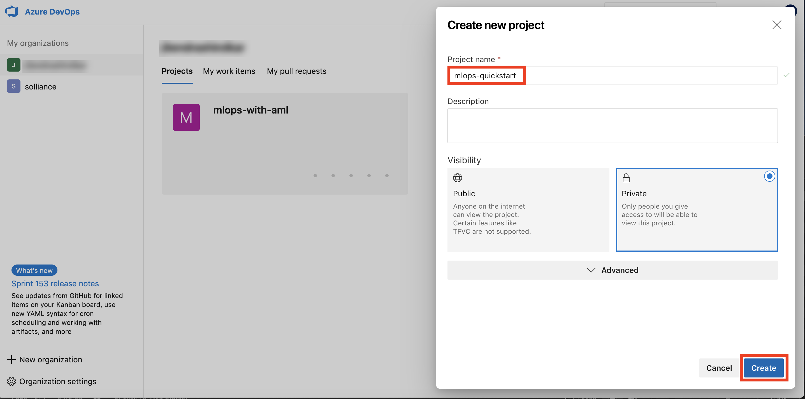

## Task 2: Import Quickstart code from a Github Repo

1. Within the new project:

   a. Select **Repos** from left navigation bar
   
   b. Select **Import** from the content section
   
      
   
2. Provide the following Github URL: `https://github.com/solliancenet/mlops-starter.git` and select **Import**. This should import the code required for the quickstart.

    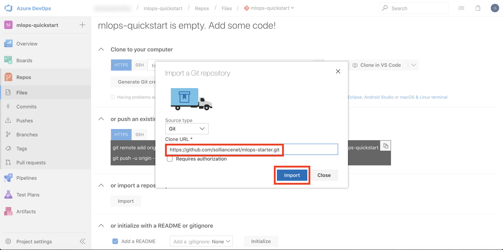

## Task 3: Update the build YAML file

1. Select and open the `azure-pipelines.yml` file
2. Select **Edit** and update the following variables: `resourcegroup`, `workspace` and `location`. If you are using your own Azure subscription, please provide names to use. If an environment is provided to you be sure to replace XXXXX in the values below with your unique identifier and update the `location` variable.

    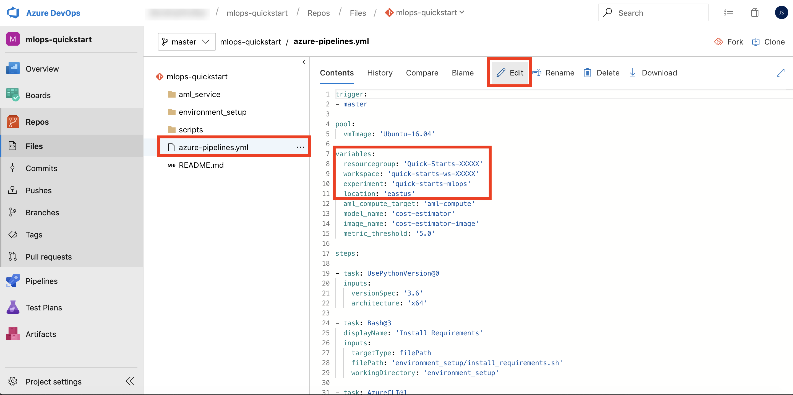

3. Select **Commit** to save your changes.

    
  
## Task 4: Create new Service Connection

1. From the left navigation select **Project settings** and then select **Service connections**

    

2. Select **New service connection** and then select **Azure Resource Manager**

    

3. Provide the following information in the `Add an Azure Resource Manager service connection` dialog box and then select **Ok**:
 
   a. Connection name: `quick-starts-sc`
   
   b. Subscription: Select the Azure subscription to use
   
   c. Resource Group: This value should match the value you provided in the `azure-pipelines.yml` file
   
    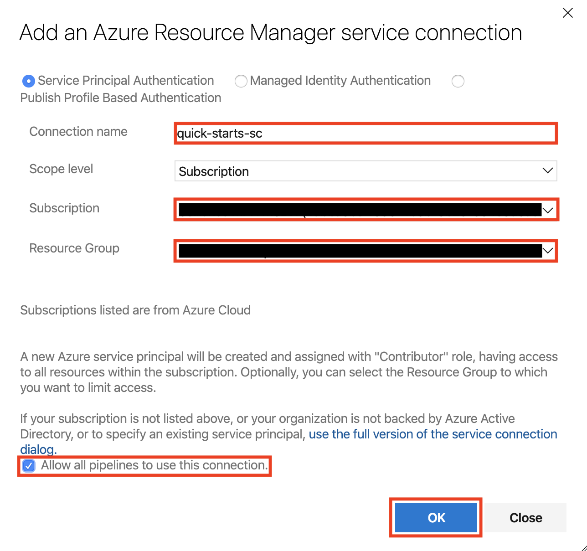

# Exercise 2: Setup and Run the CI Build Pipeline

## Task 1: Setup Build Pipeline

1. From left navigation select **Pipelines, Builds** and then select **New pipeline**

    
    
2. Select **Azure Repos Git** as your code repository

    

3. Select **mlops-quickstart** as your repository

    

4. Reivew the YAML file

    

## Task 2: Run the Build Pipeline

1. Select **Run** to start running your build pipeline

    

2. Monitor the build run. The build pipeline, for the first run, will take around *15-20 minutes* to run.

    

## Task 3: Review Build Artifacts

1. The build will publish an artifact named `devops-for-ai`. Select **Artifacts, devops-for-ai** to review the artifact contents.

    

2. Select **outputs, eval_info.json** and then select **Download**. The `eval_info.json` is the output from the *model evaluation* step and the information from the evaluation step will be later used in the release pipeline to deploy the model. Select **Close** to close the dialog.

    

3. Open the `eval_info.json` in a json viewer or a text editor and observe the information. The json output contains information such as if the model passed the evaluation step (`deploy_model`: *true or false*), and the name of the created image (`image_name`) to deploy.

    

## Task 4: Review Build Outputs

1. Log in to [Azure Portal](https://portal.azure.com). Open your **Resource Group, Workspace, Models** section, and observe the registered model: `cost-estimator`.

    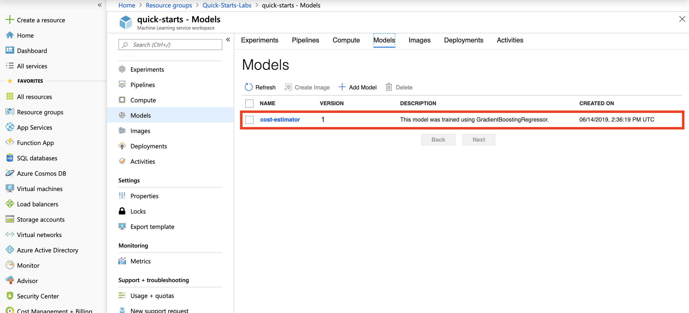

2. Open your **Resource Group, Workspace, Images** section and observe the deployment image created during the build pipeline: `cost-estimator-image`.

    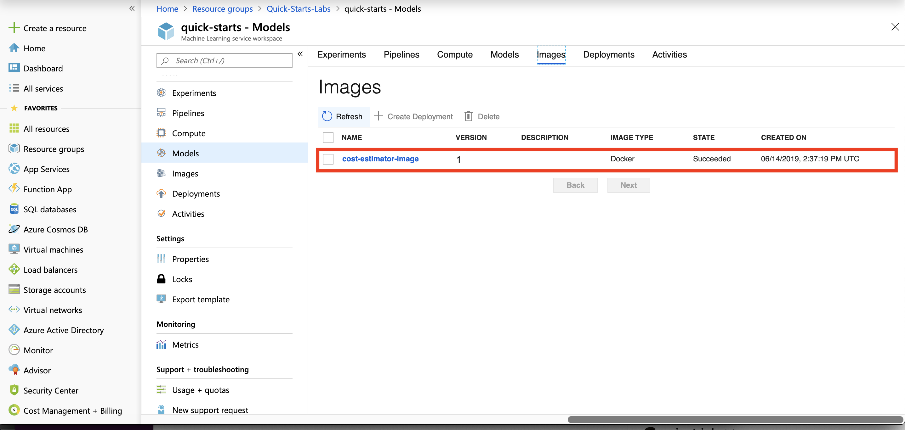
    
    
# Exercise 3: Setup the Release Pipeline

## Task 1: Create an Empty Job

1. Return to Azure DevOps and navigate to **Pipelines, Releases** and select **New pipeline**

    

2. Select **Empty job**

    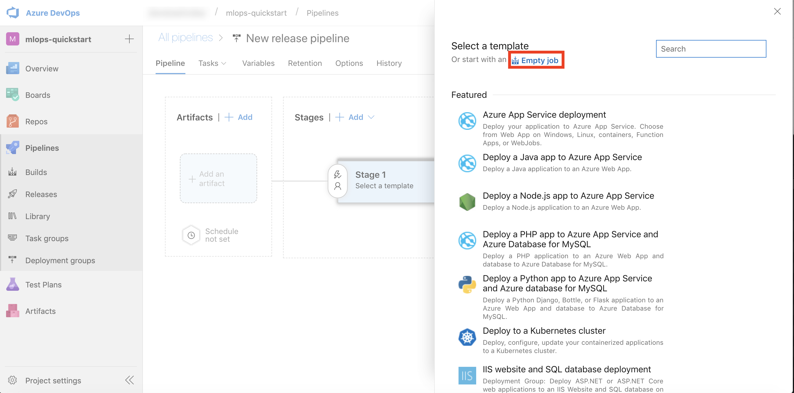

3. Provide Stage name: `Deploy & Test` and close the dialog.

    

## Task 2: Add Build Artifact

1. Select **Add an artifact**

    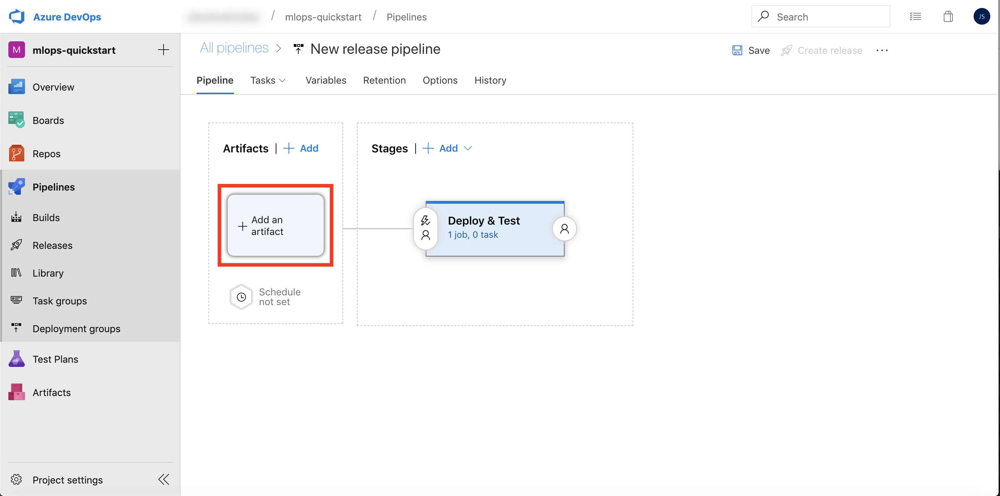

2. Select Source type: `Build`, Source (build pipeline): `mlops-quickstart`. *Observe the note that shows that the mlops-quickstart publishes the build artifact named devops-for-ai*. Finally, select **Add**

    
    
## Task 3: Add Variables to Deploy & Test stage

1. Open **View stage tasks** link

    

2. Open **Variables** tab

    

3. Add three Pipeline variables as name - value pairs and then select **Save**:

    a. Name: `aci_name` Value: `aci-cluster01`
    
    b. Name: `description` Value: `"Cost Estimator Web Service"` *note the double quotes around description value*
    
    c. Name: `service_name` Value: `cost-estimator-service`
    
      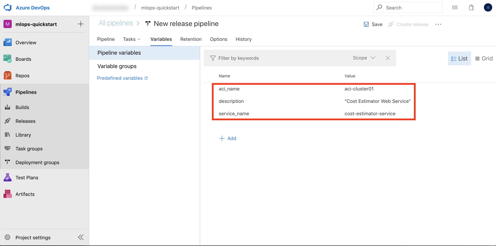
      
## Task 4: Setup Agent Pool for Deploy & Test stage
        
1. Open **Tasks** tab

    
    
2. Select **Agent job** and change **Agent pool** to `Hosted Ubuntu 1604`

    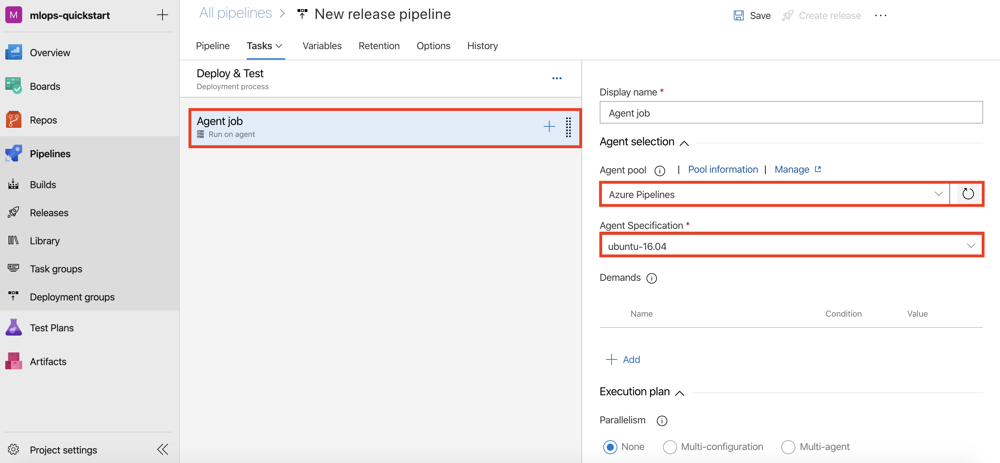
    
## Task 5: Add Use Python Version task

1. Select **Add a task to Agent job**, search for `Use Python Version`, and select **Add**

    

2. Provide **Display name:** `Use Python 3.6` and **Version spec:** `3.6`

    
    
## Task 6: Add Install Requirements task

1. Select **Add a task to Agent job**, search for `Bash`, and select **Add**
    
    

2. Provide **Display name:** `Install Requirements` and select **object browser ...** to provide **Script Path**.

    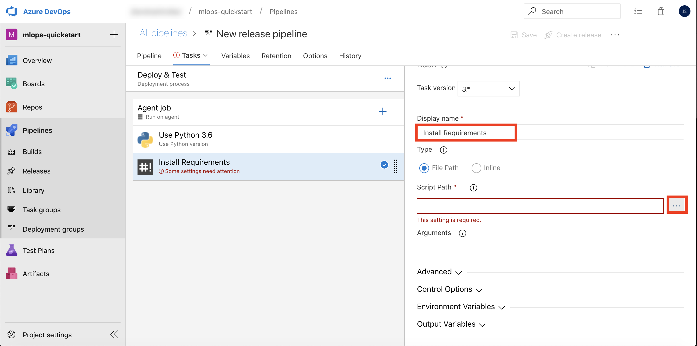

3. Navigate to **Linked artifacts/_mlops-quickstart/devops-for-ai/environment_setup** and select **install_requirements.sh**

    

4. Expand **Advanced** and select **object browser ...** to provide **Working Directory**.

    
    
5. Navigate to **Linked artifacts/_mlops-quickstart/devops-for-ai** and select **environment_setup**

    
    
## Task 7: Add Deploy & Test Webservice task
    
1. Select **Add a task to Agent job**

    
    
2. Search for `Azure CLI`, and select **Add**

    

3. Provide the following information for the Azure CLI task:

    a. Display name: `Deploy & Test Webservice`
    
    b. Azure subscription: `quick-starts-sc` *This is the service connection we created in Exercise 1 / Task 4*
    
    c. Script Location: `Inline script`
    
    d. Inline Script: `python aml_service/deploy.py --service_name $(service_name) --aci_name $(aci_name) --description $(description)`
    
      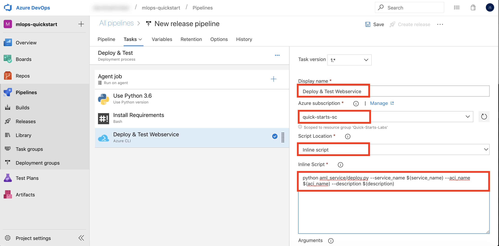

4. Expand **Advanced** and provide **Working Directory:** `$(System.DefaultWorkingDirectory)/_mlops-quickstart/devops-for-ai`

    
    
## Task 8: Define Deployment Trigger

1. Navigate to **Pipeline** tab, and select **Pre-deployment conditions** for the `Deploy & Test` stage
2. Select **After release**

    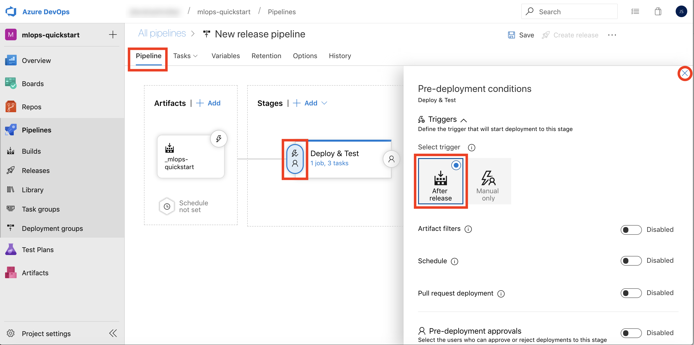

3. Close the dialog

## Task 9: Enable Continuous Deployment Trigger

1. Select **Continuous deployment trigger** for `_mlops-quickstart` artifact
2. Enable: **Creates a release every time a new build is available.**

    
    
3. Close the dialog

## Task 10: Save the Release Pipeline

1. Provide name: `mlops-quickstart-release`
2. Select: **Save**

    

3. Select: **Ok**

    
    
# Exercise 4: Test Build and Release Pipelines

## Task 1: Make Edits to Source Code

1. Navigate to: **Repos -> Files -> aml_service -> pipelines_master.py**
2. **Edit** `pipelines_master.py`
3. Make a minor edit. For example, change `print("In piplines_master.py")` to `print("In piplines_master")`
4. Select **Commit**

    
    
5. Provide comment: `Small edit to pipelines_master.py` and select **Commit**

    
    
## Task 2: Monitor Build Pipeline

1. Navigate to **Pipelines, Builds**. Observe that the CI build is triggered because of the source code change. 

   
   
2. Select the pipeline run and monitor the pipeline steps. The pipeline will run for 10-12 minutes. Proceed to the next task when the build pipeline successfully completes.
    
   

## Task 3: Monitor Release Pipeline

1. Navigate to **Pipelines, Releases**. Observe that the Release pipeline is automatically trigger upon successful completion of the build pipeline. Select as shown in the figure to view pipeline logs. 
    
   
   
2. The release pipeline will run for 5-6 minutes. Proceed to the next task when the release pipeline successfully completes.

## Task 4: Review Release Pipeline Outputs

1. From the pipeline logs view, select **Deploy & Test Webservice** task to view details.

    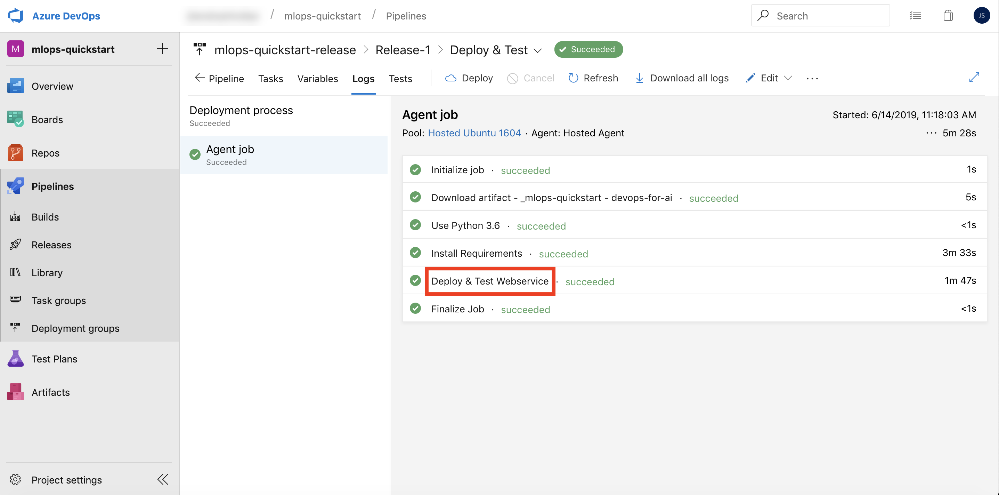
    
2. Observe the **Scoring URI** and test results for the deployed webservice.

    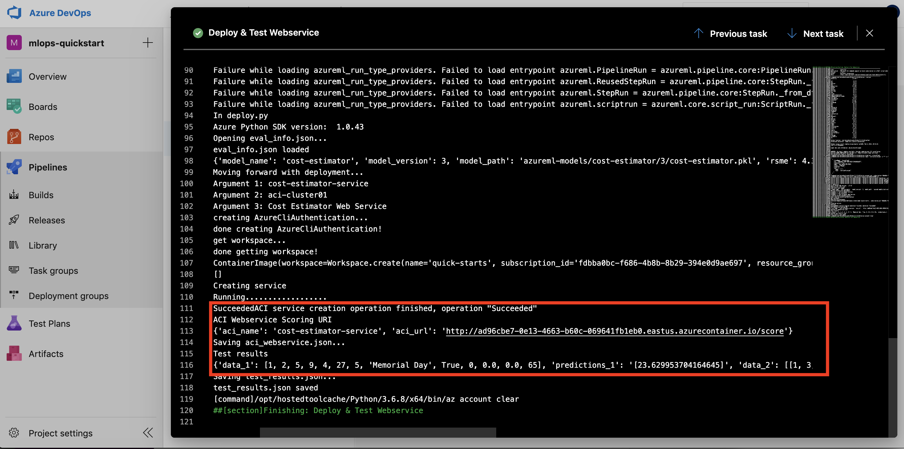

3. Log in to Azure Portal. Open your **Resource Group, Workspace, Deployments** section, and observe the deployed webservice: **cost-estimator-service**.

    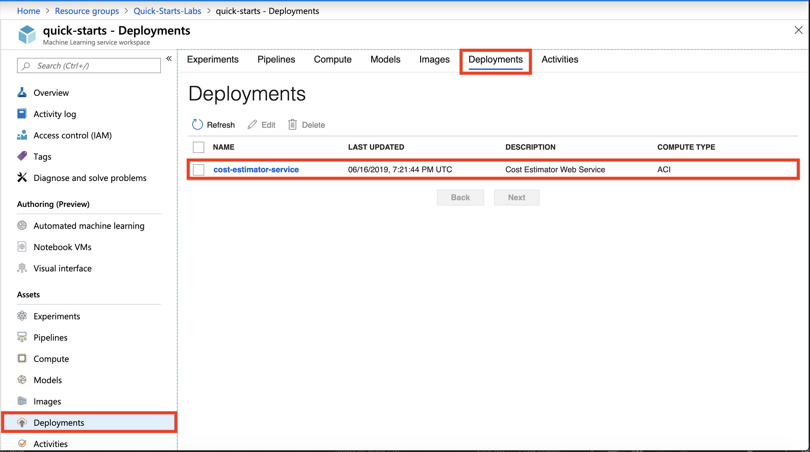

# Exercise 5: Challenge – Add a New Task to Release Pipeline 

Create a new task in the **Deploy and Test** deployment process to test the deployed webservice by making HTTP post requests to the webservice scoring URI. Please review the code `mlops-quickstart/aml_service/deploy.py` and note that it saves the deployed webservice scoring URI in a file: **./outputs/aci_webservice.json**. You can use the same arrays `data1` and `data2` as in `deploy.py` as inputs to test the webservice.

You can download the solution at the following links: [select to download test.py](https://quickstartsws9073123377.blob.core.windows.net/azureml-blobstore-0d1c4218-a5f9-418b-bf55-902b65277b85/quickstarts/mlops-challenge/test.py) and [select to download task instructions](https://quickstartsws9073123377.blob.core.windows.net/azureml-blobstore-0d1c4218-a5f9-418b-bf55-902b65277b85/quickstarts/mlops-challenge/challenge-instructions.png). Upload the **test.py** file in **mlops-quickstart/aml_service** folder.
