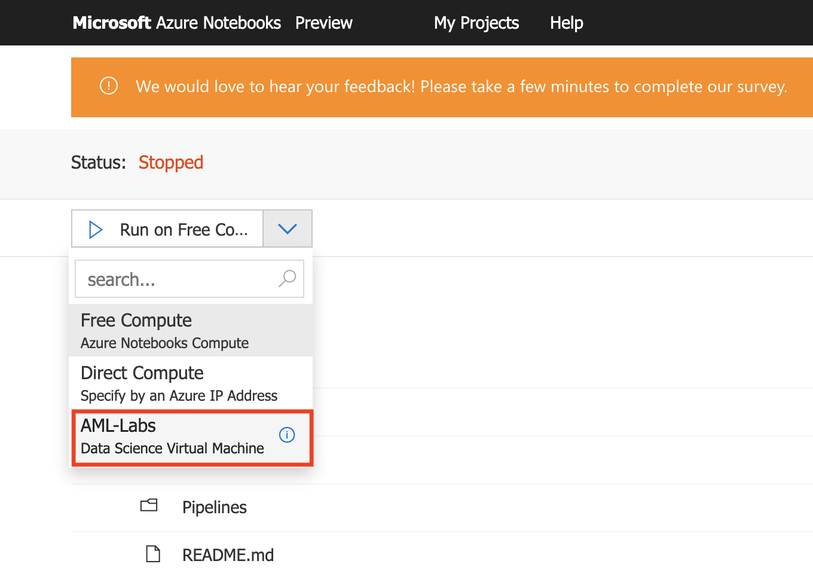
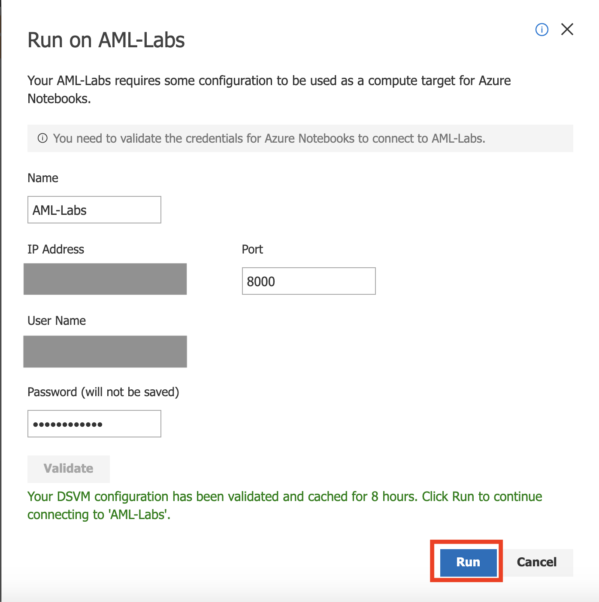
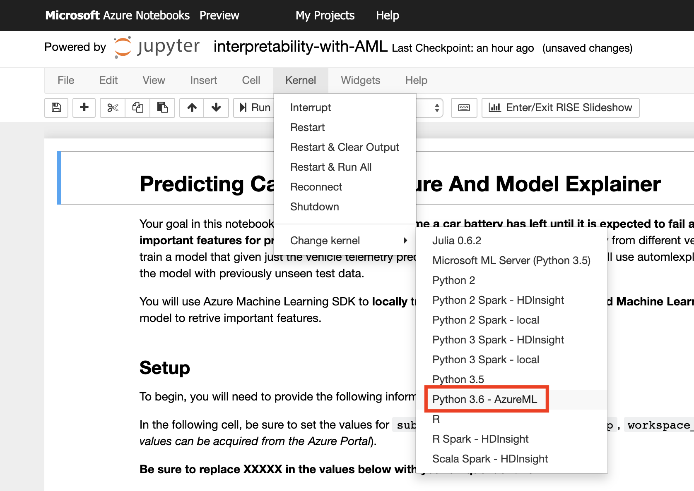

# Azure Notebooks Setup

There are five steps to setting up your Azure Notebooks Environment

1. Sign up for a free account with [Azure Notebooks](https://notebooks.azure.com/).

2. Deploy a Deep Learning Virtual Machine (DLVM).

3. Update the Azure ML Python SDK on the DLVM.

4. Upload the lab files in Azure Notebooks.

5. Connect Azure Notebooks to use the DLVM.

`Steps 2-5 are explained in details below`

## Deploy a Deep Learning Virtual Machine

1. Log into your Azure Portal

2. Navigate to the link to [create your own DLVM](https://portal.azure.com/#create/microsoft-ads.dsvm-deep-learningtoolkit)

3. Select the Create button at the bottom to be taken into a wizard.

4. The wizard used to create the DLVM requires inputs for each of the four steps enumerated on the right of this figure. It is important that you select **Linux** as your OS type for DLVM.

5. Select your VM size: **Standard NC6**

6. Complete the rest of the steps.

7. Wait for the DLVM to be `Running`. You can monitor the status of the DLVM in your Azure Portal under the `Virtual machines` section.

## Update the Deep Learning Virtual Machine

1. Obtain the public IP address `xx.xxx.xxx.xx` of the DLVM from Azure Portal.

2. Log into Jupyter hub running on the DLVM using the URL: https://xx.xxx.xxx.xx:8000/hub/login

3. Wait for the Jupyter server to start.

4. Create a New notebook with `Python 3.6 - AzureML` kernel.

5. Execute the following `1 of 2` pip command in one of the cells: `!pip install --upgrade azureml-sdk[explain,automl]`

6. Execute the following `2 of 2` pip command in one of the cells: `!pip install azureml-sdk[notebooks]`

## Upload the lab files in Azure Notebooks

1. Log in to [Azure Notebooks](https://notebooks.azure.com/).

2. Create a new project in Azure Notebooks called `Aml-quickstarts`.

3. Create one folder for each lab in your project:  01-aml-pipelines, 02-aml-interpretability, 03-aml-deep-learning, 04-aml-onnx.

4. From starter-artifacts navigate to the [python-notebooks](../../starter-artifacts/python-notebooks) link and load the files for each of the labs in their respective folders in your Azure Notebooks project. You may have to download the files first to your local computer and then upload them to Azure notebooks. Also remember to maintain any folder structure within each of the labs. For example, the 04-aml-onnx lab has the notebook file “onnx-AML.ipynb” at the root and it has one subfolder called “model” that contains a pretrained model file.

## Connect Azure Notebooks to use the DLVM

1. Open the project `Aml-quickstarts` in Azure Notebooks.

2. Select the DLVM you created as your `Compute` target.

3. Provide the requested information and click `Validate`

4. Click `Run`

5. Now you are ready to follow the steps as outlined for each of labs. Note that when you first open the starting notebook file for the lab, remember to setup `Python 3.6 - AzureML` as the kernel.

