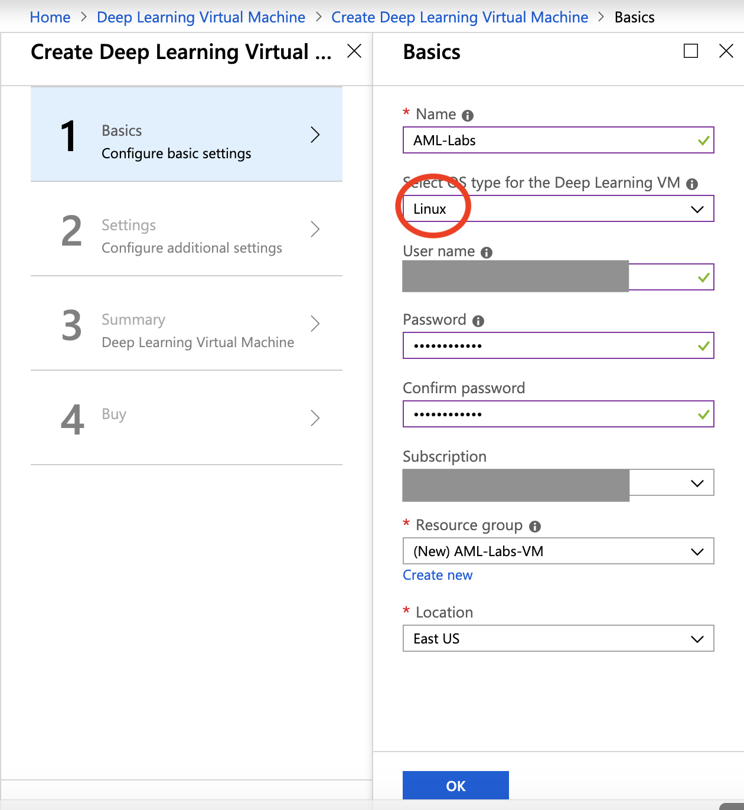
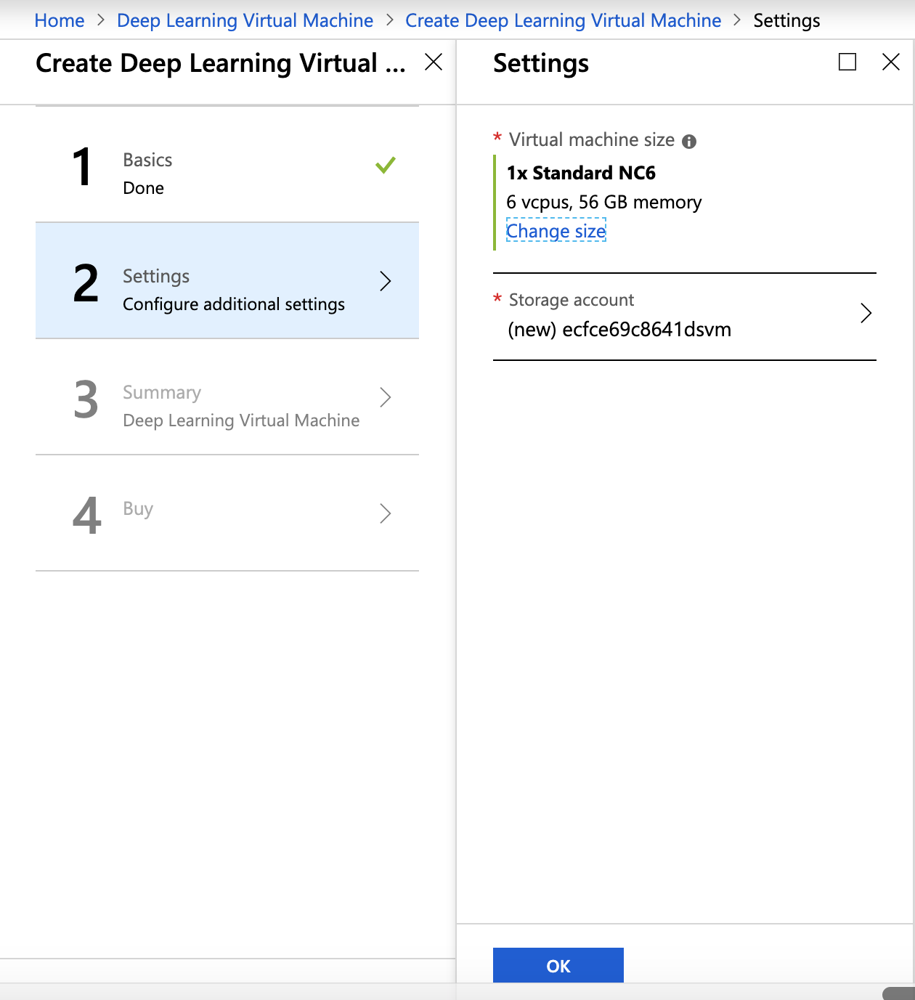
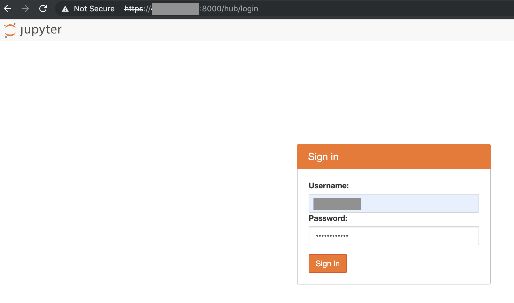
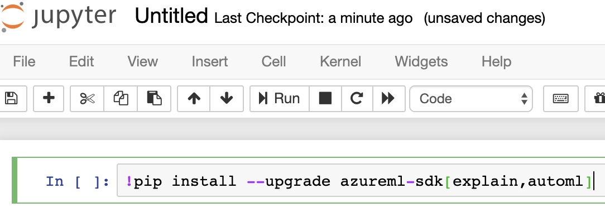
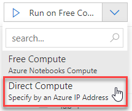

# Azure Notebooks Setup

At a high level, here are the setup steps you will need to perform to prepare your Azure Notebooks Environment (the detailed instructions follow):

1. Setup an Azure Notebooks account. 

2. Deploy a Deep Learning Virtual Machine (DLVM).

3. Update the Azure ML Python SDK on the DLVM.

4. Upload the lab files in Azure Notebooks.

5. Connect Azure Notebooks to use the DLVM.

## Setup an Azure Notebooks account
1. In your browser, navigate to https://notebooks.azure.com/.

2. Select Sign In from the top, right corner and sign in using your Microsoft Account credentials. After a successful login, you will have implicitly created the account and are ready to continue.

## Deploy a Deep Learning Virtual Machine

1. Log into the [Azure Portal](https://portal.azure.com).

2. Follow this link to [create your own DLVM](https://portal.azure.com/#create/microsoft-ads.dsvm-deep-learningtoolkit).

3. Select the **Create** button at the bottom to be taken into a wizard.

4. Provide a unique name for the VM. For OS type, be sure to select **Linux** and then provide a user name, password, and select the Subscription, Resource group and Location to which you want to deploy. Select **OK**.

5. Select your VM size: **Standard NC6** and select **OK**.

6. Select **OK** on the Summary screen and then select **Create** on the Buy step.

7. Wait for the DLVM to be `Running`. You can monitor the status of the DLVM in your Azure Portal under the `Virtual machines` section.

## Update the Azure Machine Learning SDK on the Deep Learning Virtual Machine

1. Obtain the public IP address `xxx.xxx.xxx.xxx` of the DLVM from the Azure Portal. To do this, navigate to the deployed VM, and on the Overview tab examine the Essentials panel and copy the IP address displayed under the heading **Public IP Address**.

2. Log into Jupyter hub running on the DLVM using the URL (replace with your VM's Public IP Address): https://xxx.xxx.xxx.xxx:8000/hub/login

    >If you get a security error in your browser warning you about a certificate error, select proceed in your browser. This occurs because the certificate used by the DLVM is self signed.

3. Wait for the Jupyter server to start.

4. Create a New notebook with `Python 3.6 - AzureML` kernel.

5. Execute the following pip command in one of the cells: 

    `!pip install --upgrade azureml-sdk[explain,automl]`

6. Next, execute the following pip command in one of the cells: 
 
    `!pip install azureml-sdk[notebooks]`

## Upload the lab files in Azure Notebooks

1. Log in to [Azure Notebooks](https://notebooks.azure.com/).

2. Select **Upload GitHub Repo**.

3. In the Upload GitHub Repository dialog, for the GitHub repository provide `solliancenet/azure-machine-learning-quickstarts`, and select **Import**. Allow the import a few moments to complete, the dialog will dismiss once the import has completed.

## Connect Azure Notebooks to use the DLVM

1. Open the imported project folder in Azure Notebooks.

2. In the drop down that starts with `Run on Free Co...` select **Direct Compute**.

3. Provide the following values in the Run on new direct compute target and select **Validate**:

    - **Name**: The name of the DLVM you created previously (if you used the suggested value this should be `AML-Labs`).
    - **Enter an IP**: The IP address of the DLVM.
    - **User Name**: The user name you configured to use with the DLVM.
    - **Password**: The password you configured to use with the DLVM.
    - 
    

4. Select `Run`.

5. Now you are ready to follow the steps as outlined for each of labs. Note that when you first open the starting notebook file for the lab, remember to select `Python 3.6 - AzureML` as the kernel.

